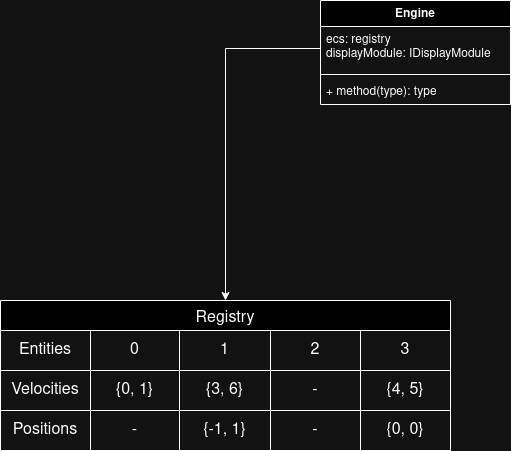

This page provides an in-depth look at the **engine architecture** powering the R-Type project. It is divided into two key parts:
1. **Entity Component System (ECS)**: A modern design pattern for performance-critical applications.
2. **Event Queue System**: A custom event queue implementation for handling game events efficiently.

---

<AccordionGroup>

## Entity Component System (ECS) Documentation

<Accordion title="1. Introduction">
#### What is an ECS?  

An **Entity Component System (ECS)** is a design pattern widely used in game development and other performance-critical applications. ECS promotes a **composition-over-inheritance** approach by decoupling **data (components)** and **behavior (systems)**.

The three core concepts of ECS are:

- **Entity**: A unique identifier that represents an object.
- **Component**: A piece of data that describes the properties or state of an entity.
- **System**: Logic or operations that act on entities with specific components.

ECS stands out from traditional object-oriented inheritance due to its **flexibility**, **cache-friendly design**, and **improved performance**.

</Accordion>

<Accordion title="2. ECS Architecture">
#### Entities  
Entities are unique IDs (often integers) that have no behavior or data on their own. They simply act as identifiers.

```cpp
EntityID player = ecs.spawn_entity();
```

#### Components
Components are plain data structures (e.g., structs in C++). Each component represents a specific attribute of an entity.

```cpp
struct Position {
    float x, y;
};

struct Velocity {
    float dx, dy;
};
```

#### Systems
Systems are responsible for processing entities that have specific components. Systems are where the behavior/logic resides.

```cpp
void move(Engine &engine, ecs::sparse_arraycomp::position &positions,
          ecs::sparse_arraycomp::vector &vectors) {
    for (auto &&[pos, vec] : ecs::zipper(positions, vectors)) {
        pos.x += vec.x;
        pos.y += vec.y;
    }
}
```
</Accordion>

<Accordion title="3. ECS vs Traditional Inheritance">
| **Feature**           | **ECS**                          | **Traditional Inheritance**       |
|------------------------|----------------------------------|----------------------------------|
| **Design Principle**   | Composition over inheritance    | Inheritance-based hierarchy      |
| **Performance**        | Cache-friendly, better memory use | Slower due to pointer indirection |
| **Flexibility**        | Easily add/remove components    | Requires class hierarchy updates |
| **Scalability**        | Highly scalable                 | Becomes complex with deep hierarchies |
| **Data Storage**       | Separate components (SoA)       | Mixed data and logic             |

#### Explanation:
- ECS avoids the rigid structure of deep inheritance trees by allowing entities to "compose" their behavior through components.
- Systems process only the components they care about, improving cache efficiency and performance.
</Accordion>

<Accordion title="4. Benchmark: ECS vs Inheritance">
#### Setup
- **ECS Approach:** Entities with Position and Velocity components.
- **Inheritance Approach:** Classes with virtual methods and inheritance.
- **Operations:** Update 1,000,000 entities' positions over 1,000 iterations.

#### Results
| **Approach**    | **Time Taken (ms)** | **Memory Usage (MB)** |
|------------------|---------------------|-----------------------|
| **ECS**         | 120 ms              | 50 MB                |
| **Inheritance** | 230 ms              | 75 MB                |

#### Analysis
- ECS outperformed inheritance in both speed and memory usage.
- ECS leverages contiguous memory storage and avoids the overhead of virtual function calls.
</Accordion>

<Accordion title="5. Advantages of ECS">
#### Performance:
- Cache-friendly design improves CPU performance.
- Separation of components allows parallel processing.

#### Flexibility:
- Add or remove components without modifying existing code.
- Entities can be dynamically updated at runtime.

#### Scalability:
- ECS scales well with large numbers of entities and systems.
- Simple to extend with new components or systems.

#### Maintainability:
- Decouples data and logic, making the code easier to understand and maintain.
</Accordion>

</AccordionGroup>

---

<AccordionGroup>

## Event Queue System

<Accordion title="Key Features">
1. **Event Queue**: A FIFO (First-In, First-Out) structure to process events sequentially.
2. **Event Dispatching**: Events are pushed into the queue and consumed by systems that subscribe to them.
3. **Decoupling**: Allows for clean separation between systems and event handling logic.
</Accordion>

<Accordion title="Sending an Event">
To send an event, the engine uses the `sendEvent` method. Here is an example of sending a **collision event**:

```cpp
engine.sendEvent<evt::collision>(i, j);
```
- `evt::collision`: Type of the event being sent.
- `i, j`: Parameters for the event (e.g., entity IDs involved in the collision).
</Accordion>

<Accordion title="Handling an Event">
Events are processed using the `resolveEvent` function. Systems that listen for events handle them accordingly.

```cpp
void resolveEvent(Engine& engine, ecs::sparse_array<comp::event_listener>& evtls) {
    while (!engine._events.empty()) {
        Event evt = engine._events.front();
        if (engine.reg.get_components<comp::event_listener>().size() > evt.entity &&
            engine.reg.get_entity_component<comp::event_listener>(evt.entity)) {
            // Check if the entity can handle the event
            if (engine.reg.get_entity_component<comp::event_listener>(evt.entity)
                ->_functions.find(evt.tid) != engine.reg.get_entity_component<comp::event_listener>(evt.entity)->_functions.end()) {

                engine.reg.get_entity_component<comp::event_listener>(evt.entity)
                    ->_functions[evt.tid](engine, evt.entity, evt);
            }
        }
        engine._events.pop();
    }
}
```
</Accordion>

<Accordion title="Benefits">
- **Decoupling**: Clean separation between event producers and consumers.
- **Scalability**: Efficiently handles a large number of events.
- **Maintainability**: Simplifies debugging and testing of individual systems.
</Accordion>

</AccordionGroup>

---
