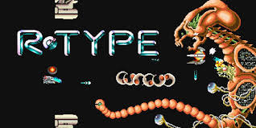

R-Type is a classic shoot 'em up game reimagined as a multiplayer networked experience. This project focuses on creating a robust **client-server architecture** that enables real-time gameplay between multiple players. The goal is to implement the core mechanics of R-Type while ensuring scalability, performance, and smooth communication over a network.

---

## What You’ll Find Here

This documentation provides everything you need to understand, set up, and contribute to the project, including:

- **Installation Instructions**: Set up the project and its dependencies on Linux, macOS, or Windows.
- **Engine Overview**: Learn about the game engine, including the Entity Component System (ECS) and the Event Queue System.
- **Network Protocols**: Explore the communication protocols used (TCP/UDP), message handling, and serialization.
- **Server Architecture**: Understand the server's implementation using ASIO, its benchmarks, and comparisons with other libraries.
- **Graphical Module**: Learn about the graphical interface implementation, SFML benchmarks, and how to add new graphical libraries.
- **Asset Management**: Discover how assets (images, sounds, etc.) are structured and managed.
- **CI/CD Pipeline**: Explore the continuous integration and deployment processes, including linters, testing, and mirroring to repositories.
- **Contributing Guide**: Steps to add new graphical libraries, implement new games, or extend server commands.

---

## Get Started 🚀

Click here to get started with the **[Getting Started](./getting-started)** section!

---