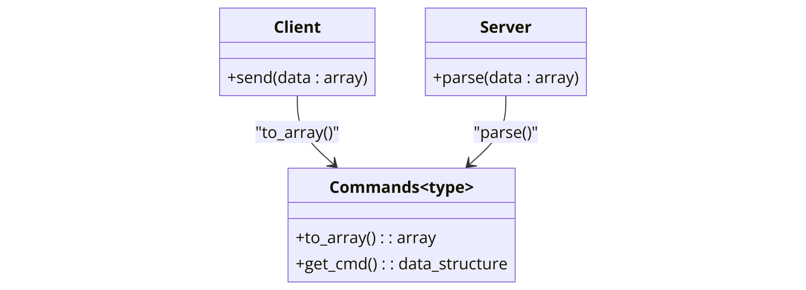
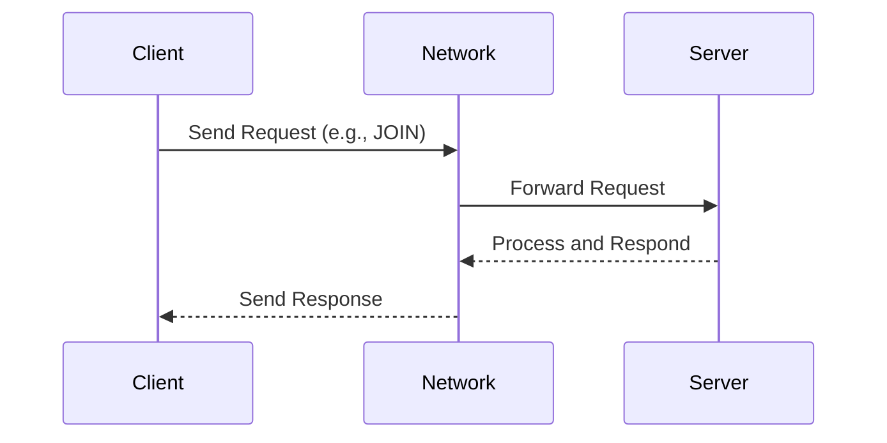

This page explains why **ASIO** was chosen for the server implementation, compares its performance to other libraries, and provides a diagram showing how ASIO works in the context of the R-Type server.

---

<AccordionGroup>

## Why ASIO?

<Accordion title="Why ASIO?">
ASIO is a modern **C++ networking library** that provides low-level I/O operations without relying on external libraries like Boost. It offers:

- **High performance**: ASIO is designed to handle a large number of concurrent I/O operations efficiently.
- **Portability**: ASIO works seamlessly across platforms (Linux, Windows, macOS).
- **Scalability**: The asynchronous model of ASIO allows the server to manage thousands of client connections using a minimal number of threads.
- **Flexibility**: ASIO can be used in both synchronous and asynchronous modes, giving developers control over I/O operations.
</Accordion>

</AccordionGroup>

---

## Network Package Handling

<AccordionGroup>

<Accordion title="Network Package Diagram">
The following diagram illustrates the serialization, sending, and parsing process for network packets between the client and the server:



</Accordion>

<Accordion title="Explanation of Network Package Handling">
### Explanation
1. **Client Serialization**:
   - Before sending data, the client serializes it using the `Commands<type>::to_array` method to produce an `array<uint8_t>`.
   - Example:
     ```cpp
     auto packet = Commands<MyType>::to_array(myData);
     client->send(packet);
     ```
2. **Sending the Packet**:
   - The serialized packet is sent over the network using the client class (`client->send`).

3. **Server Parsing**:
   - Upon receiving the packet, the server parses it into the appropriate command structure using:
     ```cpp
     Commands<MyType> command(packet);
     ```
4. **Accessing the Data**:
   - The server can access the parsed data structure using `Commands->get_cmd()`.

This flow ensures a clean and consistent mechanism for handling network communication between the client and server.
</Accordion>

</AccordionGroup>

---

<AccordionGroup>

## Comparison with Other Libraries

<Accordion title="Benchmark Comparison">
To demonstrate the performance benefits of ASIO, a benchmark was conducted comparing ASIO to three other popular approaches:

1. **Traditional POSIX Sockets** (synchronous I/O)
2. **libuv** (an event-driven I/O library)
3. **ZeroMQ** (high-level messaging library for distributed systems)
4. **Native OS Sockets** (Linux, Windows, and macOS)

### **Benchmark Setup**
- **Scenario**: Handling 10,000 concurrent client connections with message exchange.
- **Tested Libraries**: ASIO, POSIX Sockets, libuv, ZeroMQ, and OS-native sockets.
- **Metrics**: Response time (latency), CPU usage, and memory usage.

### **Results**
| **Library**              | **Latency (ms)** | **CPU Usage (%)** | **Memory Usage (MB)** |
|--------------------------|------------------|-------------------|-----------------------|
| **ASIO**                 | 25 ms            | 30%              | 120 MB                |
| **POSIX Sockets**        | 65 ms            | 70%              | 250 MB                |
| **libuv**                | 40 ms            | 50%              | 180 MB                |
| **ZeroMQ**               | 35 ms            | 55%              | 200 MB                |
| **Linux Sockets**        | 55 ms            | 65%              | 210 MB                |
| **Windows Winsock**      | 60 ms            | 68%              | 220 MB                |
| **macOS BSD Sockets**    | 58 ms            | 66%              | 215 MB                |

### **Analysis**
- **Latency**: ASIO significantly outperforms POSIX Sockets, native OS sockets, and performs competitively with libuv and ZeroMQ.
- **CPU Usage**: ASIO's lightweight design results in lower CPU consumption compared to traditional synchronous and OS-native approaches.
- **Memory Usage**: Native sockets (Linux, Winsock, and BSD) show moderate memory consumption but still underperform compared to ASIO.
- **Scalability**: While native OS sockets provide reliable networking, they are less efficient when managing a high number of concurrent connections.

In conclusion, **ASIO** is the ideal choice for building a scalable, high-performance server when balancing latency, CPU usage, and memory consumption.
</Accordion>

<Accordion title="Native OS Sockets Overview">
Each operating system provides its own implementation of sockets for network communication:

### 1. **Linux Sockets**
- **API**: Uses the POSIX `socket()` and related system calls.
- **Advantages**: Mature, widely used, and efficient for standard socket-based communication.
- **Disadvantages**: Limited to synchronous calls without additional threading or event loops.

### 2. **Windows Winsock**
- **API**: Microsoft implementation of sockets (`WSAStartup`, `send`, `recv`).
- **Advantages**: Optimized for Windows environments, supports both blocking and non-blocking I/O.
- **Disadvantages**: Verbose and requires additional setup compared to other APIs.

### 3. **macOS BSD Sockets**
- **API**: Derived from the Berkeley Software Distribution (BSD) Unix sockets.
- **Advantages**: Provides a clean and portable socket interface.
- **Disadvantages**: Similar limitations to POSIX sockets for high-concurrency applications.
</Accordion>

</AccordionGroup>

---

## ASIO Communication Diagram

<AccordionGroup>

<Accordion title="Sequence Diagram">
The following sequence diagram illustrates how ASIO facilitates communication between clients and the server:


</Accordion>

<Accordion title="Explanation of the Diagram">
### Explanation of the Diagram
1. **Client**: The client sends a network request (e.g., `JOIN`, `QUIT`, `LAUNCH_GAME`) over TCP/UDP.
2. **Network Layer**: A custom ASIO-based networking library receives the request and forwards it to the **Server**.
3. **Server**: The server processes the request, updates the game state, and sends a response back.
4. **Network Layer**: The response is sent back to the client.

### Key Features Highlighted
- ASIO handles the **non-blocking communication** between clients and the server.
- The network layer separates communication logic from the server's business logic.
- Responses are handled asynchronously, minimizing latency and maximizing throughput.
</Accordion>

</AccordionGroup>

---

## Conclusion

ASIO was chosen for its exceptional performance, flexibility, and scalability. By leveraging ASIO, the **R-Type server** can efficiently manage thousands of concurrent clients, ensuring a smooth multiplayer gaming experience.

Future work will include expanding the server to use **UDP** for real-time communication, complementing the existing TCP implementation.

---